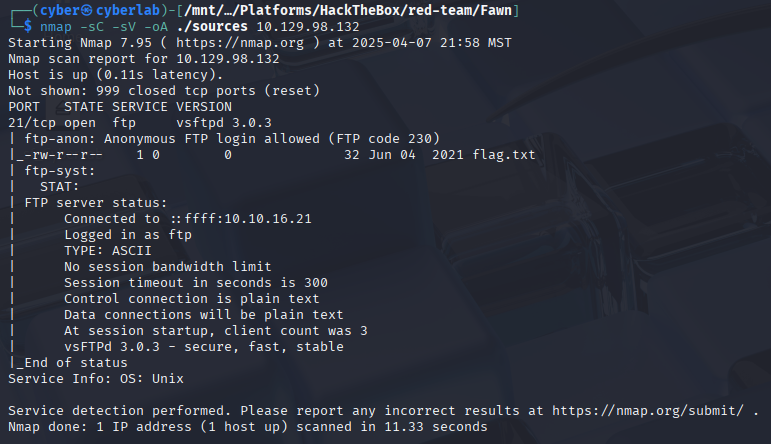
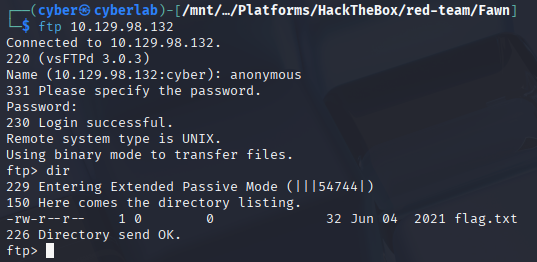

---
tags:
  - htb
  - starting-point
  - red-team
  - beginner
  - walkthrough
title: Fawn (Starting Point)
description: Quick enumeration and flag capture of the Fawn box in Hack The Box's Starting Point path.
date: 2025-04-07
---

# Fawn (Starting Point)

## Box Info

- **Difficulty:** Very Easy
- **IP Address:** 10.129.98.132
- **Attack Vector:** Anonymous FTP Access
- **Flag Type:** User flag
- **Methodology:** Basic enumeration → access → retrieve flag

---

## Recon

### Nmap Scan

```bash
nmap -sC -sV -oA sources/ 10.129.98.132
```

- **Open Port(s):** 21/tcp - FTP 
> [!note]
> Nmap noted that anonymous ftp login is allowed. On a properly secured system a username and password would be required for login.

---

## Exploitation

- **Access Method:** FTP server is active and anonymous login allowed
- **Command(s) Used:**
  ```bash
  ftp 10.129.98.132
  ```
- **Username used:** anonymous
- **Password used:** Leave blank
---
- **Flag Location:** flag.txt
- **Command to download Flag:**
  ```bash
  get flag.txt
  ```
---
- **Command to read flag:** 
```bash
cat flag.txt
```
- **Flag:** [Redacted]

### Nmap Screenshot


### Login Screenshot


---

## Notes

- No ftp authentication required
- Learn basic ftp commands like dir and get
- Ftp transmits in plaintext and is insecure. Newer protocols exist such as SFTP (FTP over SSH) which encrypts the transmission of data.

---

## Tools Used

| Tool | Purpose                       |
| ---- | ----------------------------- |
| nmap | Port and service scan         |
| ftp  | Legacy file transfer protocol | 
