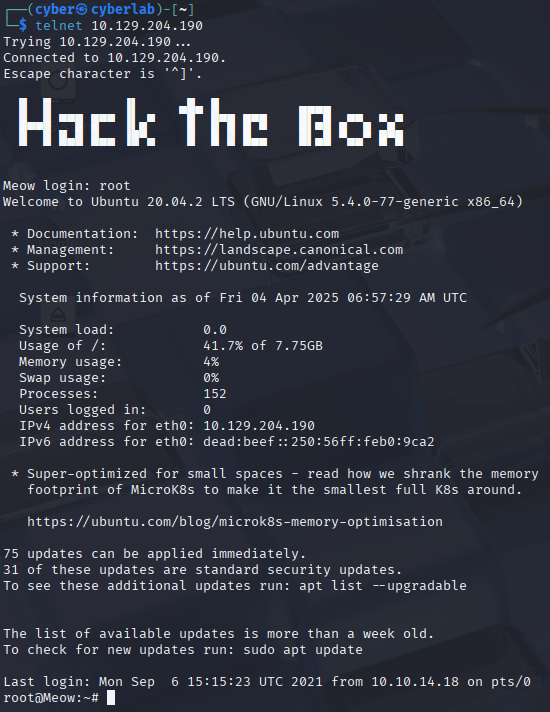

---
tags:
  - htb
  - starting-point
  - red-team
  - beginner
  - walkthrough
title: Meow (Starting Point)
description: Quick enumeration and flag capture of the Meow box in Hack The Box's Starting Point path.
date: 2025-04-04
---

# Meow (Starting Point)

## Box Info

- **Difficulty:** Very Easy
- **IP Address:** 10.129.204.190
- **Attack Vector:** Open service access
- **Flag Type:** User flag
- **Methodology:** Basic enumeration → access → retrieve flag

---

## Recon

### Nmap Scan

```bash
nmap -sC -sV -oA ./sources 10.129.204.190
```

- **Open Port(s):** 23/tcp — Telnet?

---

## Exploitation

- **Access Method:** Telnet is open and allows login as root
- **Command(s) Used:**
  ```bash
  telnet 10.129.204.190
  ```

- **Flag Location:** /root/flag.txt or similar  
- **Command to Read Flag:**
  ```bash
  cat flag.txt
  ```

- **Flag:** [Redacted]

### Login Screenshot


---

## Notes

- No authentication, no shell access needed
- Great first box to test VPN connection and understand HTB’s flag submission
- Good candidate for automation if building tooling later

---

## Tools Used

| Tool   | Purpose                                                       |
| ------ | ------------------------------------------------------------- |
| nmap   | Port and service scan                                         |
| telnet | Legacy remote management protocol; grants remote shell access |
